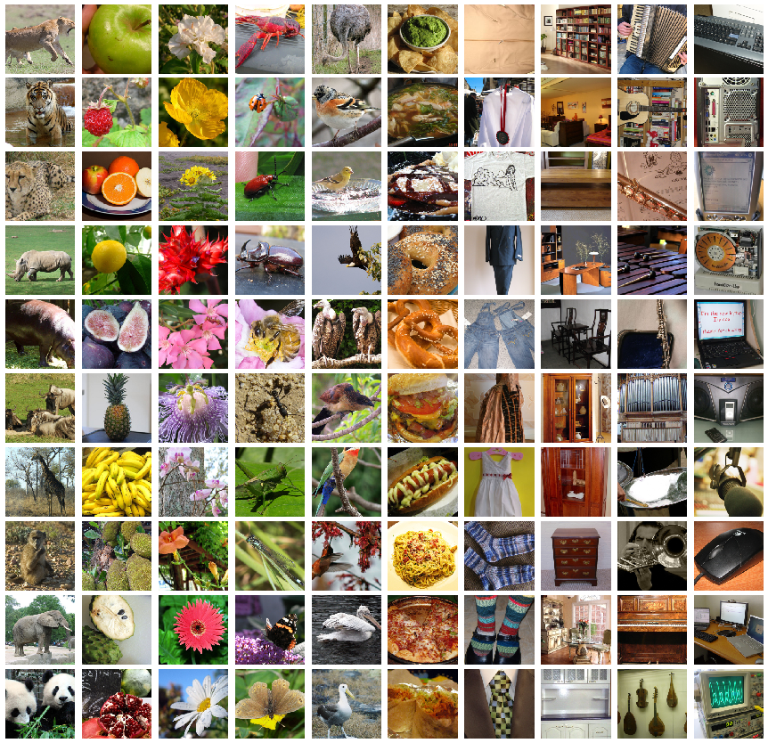
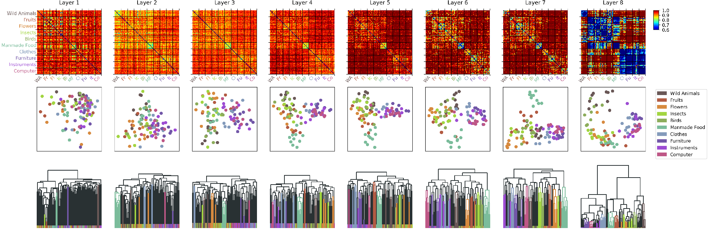

#### Representational Dissimilarity Analysis
[Representational Dissimilarity Analysis](https://nikokriegeskorte.org/category/representational-similarity-analysis/)
looks at the pairwise correlation of neural activity given different stimuli. 
How active are particular neurons of a subject if the subject is seeing a house versus if the subject is seeing an apple?

I explored representational dissimilarity 
of stimuli in medial temporal lobe and deep neural networks as part of my [MSNE](https://www.msne.ei.tum.de/en/home/) research project with 
[Prof. Jakob Macke@CNE]( https://github.com/cne-tum "Computational Neuroengineering"). 

This package resulted from our project and provides **automated** representational dissimilarity analysis and comparison for 
preprocessed brain recordings, AlexNet, VGG, and ResNet.

#### Example usage:
We want to know how 10 images from 10 semantically different classes from [Imagenet](http://www.image-net.org/) are represented in a AlexNet.

Here are the images (one column corresponds to one class):



And here's the code:

```python
experiment = ImagenetExperiment()   # init experiment, links to the images
visualization = RDMVis(experiment)  # init plotter

dataset = RDMDataset(experiment)    # this is a pytorch dataset
activations = DNNActivations("alexnet", dataset) # automatically downloads the pretrained alexnet from pytorch

rdms = RDM(activations) 

vis.plot(rdms) 
```

Giving these results:



Note: Cleaning the code is still work in progress. Example notebooks should be available soon. Feel free to contact me.


